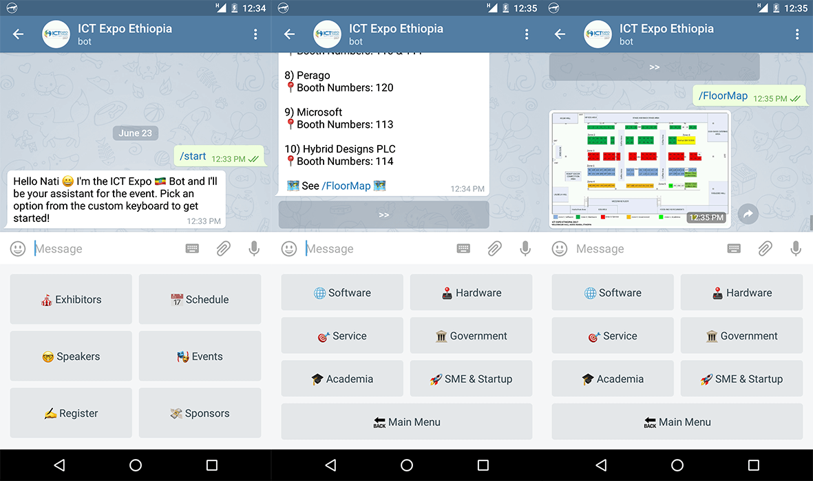

# Telegram Bot for ICT Expo Ethiopia 2017

This is the official telegram bot for the first international ICT Expo in Ethiopia 🇪🇹 (June 28 - July 02). Over 200,000 are expected to attend!

You can play with the bot [here](https://t.me/ictexpobot)

## Progress
- [x] Send Exhibitors, schedule, speakers, events, sponsors, floor plan
- [x] Use apiai to do NLP (smalltalk with the user and accepts commands, questions)
- [ ] Conversational form to register users for the lotto
- [ ] Set reminder feature for events and daily schedule
- [ ] Collect website, tel and logo of all exhibitors, logos for sponsors & urls for learn more on the speaker cards
- [ ] Show the github contributors within the bot
- [ ] After expo ends make it generic enough so anyone can just replace the JSON data and have a good starting point for a new expo, conference or exhibition bot

## Building and Deploying
Run `$ yarn` to install the dependencies and set these environment variables:

- **EXPO_BOT_TOKEN** - Talk to [Bot Father](https://t.me/botfather) to get your token
- **EXPO_API_AI_TOKEN** - Sign up on [apiai](https://api.ai) to get your token

Optional

- **EXPO_BOT_URI**
- **PORT**

You'll need the above two if you want to setup a webhook with telegram. Or you can just run the server locally by running `$ yarn start`

## Contributing

Contributions are welcome...even during the expo! There will be space there to hack on the bots[1] together & to show anyone interested the basics. Contributors will be shown within the bot.

[1] There's also a [Messenger Bot](https://github.com/ntgx/expo-bot-messenger)

#### Contributing a fix or feature

1. Submit an [issue](https://github.com/ntgx/expo-bot-messenger/issues) describing your proposed fix or feature.
2. If your proposed fix or feature is accepted then, fork, implement your code change.
3. Ensure your code change follows the [accepted code style and structure](#code-style-and-structure).
4. Ensure your code is properly tested.
5. Ensure your commits follow the accepted [commit message style](#git-commit-messages)
6. Submit a pull request.

#### Code style and structure
The coding style must conform with the [Airbnb JavaScript Style Guide](https://github.com/airbnb/javascript). Run `$yarn --dev` to install the linter.

#### Git commit messages
This hasn't been the case so far but try to use [Udacity's Git commit message style guide](https://udacity.github.io/git-styleguide/).

## Screenshots

## License

MIT License

Copyright (c) 2017 Nati Gossaye

Permission is hereby granted, free of charge, to any person obtaining a copy
of this software and associated documentation files (the "Software"), to deal
in the Software without restriction, including without limitation the rights
to use, copy, modify, merge, publish, distribute, sublicense, and/or sell
copies of the Software, and to permit persons to whom the Software is
furnished to do so, subject to the following conditions:

The above copyright notice and this permission notice shall be included in all
copies or substantial portions of the Software.

THE SOFTWARE IS PROVIDED "AS IS", WITHOUT WARRANTY OF ANY KIND, EXPRESS OR
IMPLIED, INCLUDING BUT NOT LIMITED TO THE WARRANTIES OF MERCHANTABILITY,
FITNESS FOR A PARTICULAR PURPOSE AND NONINFRINGEMENT. IN NO EVENT SHALL THE
AUTHORS OR COPYRIGHT HOLDERS BE LIABLE FOR ANY CLAIM, DAMAGES OR OTHER
LIABILITY, WHETHER IN AN ACTION OF CONTRACT, TORT OR OTHERWISE, ARISING FROM,
OUT OF OR IN CONNECTION WITH THE SOFTWARE OR THE USE OR OTHER DEALINGS IN THE
SOFTWARE.

